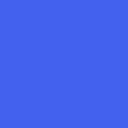
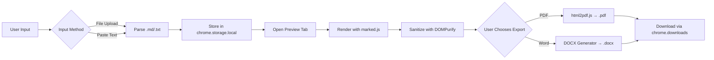

<div align="center">
  <picture>
    <source media="(prefers-color-scheme: dark)" srcset="assets/icon128.png">
    
  </picture>
  <h1 align="center">MD to Word/PDF Converter</h1>
  <p align="center">
    <strong>A Chrome Extension to convert Markdown files to Word (.docx) or PDF with live preview</strong>
  </p>
  <p align="center">
    <a href="#features">Features</a> •
    <a href="#demo">Demo</a> •
    <a href="#installation">Installation</a> •
    <a href="#usage">Usage</a> •
    <a href="#project-structure">Project Structure</a> •
    <a href="#development">Development</a> •
    <a href="#tech-stack">Tech Stack</a> •
    <a href="#contributing">Contributing</a> •
    <a href="#license">License</a>
  </p>
</div>

---

## Features

- ✅ **Upload Markdown files** — Drag & drop or browse for `.md`, `.markdown`, or `.txt` files
- ✅ **Paste Markdown text** — Directly type or paste Markdown content into the editor
- ✅ **Live Preview** — GitHub-flavored Markdown (GFM) rendered in real-time with syntax highlighting
- ✅ **Export to PDF** — High-quality, print-ready PDF generation using `html2pdf.js`
- ✅ **Export to Word** — Native `.docx` generation via a custom lightweight DOCX engine (Open XML + JSZip)
- ✅ **Word & Character Count** — Real-time statistics for your content
- ✅ **XSS Protection** — Built-in sanitization with DOMPurify
- ✅ **Modern UI** — Clean, responsive interface
- ✅ **100% Offline** — All processing happens locally in your browser. No data ever leaves your machine.
- ✅ **Free & Open Source** — MIT licensed. No ads, no tracking.

## Installation

### From Chrome Web Store (Recommended)

> Coming soon — the extension is currently in development.

### Manual Installation (Developer Mode)

1. **Download** or clone this repository:
   ```bash
   git clone https://github.com/SuriyaG894/md-converter-ext.git
   ```
2. **Open Chrome** and navigate to `chrome://extensions/`

3. **Enable Developer Mode** (toggle in the top-right corner)

4. **Click "Load Unpacked"** and select the project root folder (`md-converter-ext`)

5. The extension icon will appear in your toolbar — click it to start converting!

## Usage

### 1. Input Markdown

Open the extension popup and choose your input method:

**Upload a file:**
- Click "Upload File" tab
- Drag & drop a `.md`, `.markdown`, or `.txt` file onto the drop zone
- Or click "Choose File" to browse

**Paste text:**
- Click "Paste Text" tab
- Write or paste your Markdown content directly into the text area

### 2. Preview

Click the **Preview** button to open a full-page live preview of your rendered Markdown.

### 3. Export

Choose your format using the toggle (PDF / Word) and click **Download**:

- **PDF** — Generates a print-ready PDF with A4 formatting
- **Word** — Generates a `.docx` file with proper heading styles, lists, code blocks, and tables

## Project Structure

```
md-converter-ext/
├── assets/                      # Extension icons (16px, 48px, 128px)
├── background/
│   └── service-worker.js        # Chrome extension service worker
├── css/
│   └── markdown.css             # GitHub-flavored Markdown styling
├── lib/
│   ├── docx-generator.js        # Custom lightweight DOCX engine (Open XML)
│   ├── html2pdf.bundle.min.js   # PDF generation library
│   ├── jszip.min.js             # ZIP archive creation for DOCX packaging
│   ├── marked.min.js            # Markdown parser
│   └── purify.min.js            # DOMPurify — XSS sanitization
├── popup/
│   ├── popup.css                # Extension popup styles
│   ├── popup.html               # Popup interface (upload / paste tabs)
│   └── popup.js                 # Popup logic
├── preview/
│   ├── preview.css              # Preview page styles
│   ├── preview.html             # Full-page preview & export UI
│   └── preview.js               # Preview rendering & download handlers
├── manifest.json                # Chrome Extension Manifest V3
└── README.md                    # This file
```

## How It Works



## Tech Stack

| Technology | Purpose |
|---|---|
| [Chrome Extension Manifest V3](https://developer.chrome.com/docs/extensions/mv3/) | Extension platform |
| [marked.js](https://marked.js.org/) | Markdown parsing & rendering |
| [DOMPurify](https://github.com/cure53/DOMPurify) | HTML sanitization (XSS prevention) |
| [html2pdf.js](https://ekoopmans.github.io/html2pdf.js/) | Client-side PDF generation |
| [JSZip](https://stuk.github.io/jszip/) | ZIP packaging for DOCX files |
| Custom DOCX Engine | Lightweight Open XML generator (no server needed) |

## Development

### Prerequisites

- Google Chrome (or any Chromium-based browser)
- No build tools required — this is a vanilla JS project

### Local Development

1. Load the extension in Chrome (see [Installation](#manual-installation-developer-mode))
2. Make changes to the source files
3. Go to `chrome://extensions/` and click the **Reload** icon on the extension card
4. Test your changes

### Adding Features

- **Input methods** — Edit `popup/popup.js` and `popup/popup.html`
- **Preview rendering** — Edit `preview/preview.js`
- **Export formats** — Extend `preview/preview.js` and `lib/docx-generator.js`

## Contributing

Contributions are welcome and encouraged! Here's how you can help:

1. **Fork** the repository
2. **Create a feature branch**: `git checkout -b feature/amazing-feature`
3. **Commit your changes**: `git commit -m 'Add amazing feature'`
4. **Push to the branch**: `git push origin feature/amazing-feature`
5. **Open a Pull Request**

### Reporting Issues

Found a bug? Have a suggestion? [Open an issue](https://github.com/SuriyaG894/md-converter-ext/issues) — we'd love to hear from you!

### Roadmap

- [ ] Dark mode support
- [ ] Custom CSS theming for exports
- [ ] Batch file conversion
- [ ] Export to HTML
- [ ] Command-line Markdown linting indicators
- [ ] Internationalization (i18n)

## License

Distributed under the **MIT License**. See [LICENSE](LICENSE) for more information.

---

<div align="center">
  <p>Built with ❤️ for the open-source community</p>
  <p>
    <a href="https://github.com/SuriyaG894/md-converter-ext/issues">Report Bug</a> •
    <a href="https://github.com/SuriyaG894/md-converter-ext/issues">Request Feature</a>
  </p>
</div>


